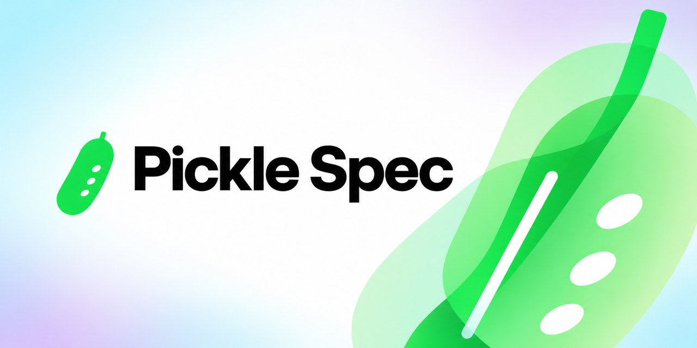

# Pickle Spec

Pickle Spec runs Gherkin Specifications against execution targets. The web
adapter uses Stagehand for browser automation, and the mobile adapter uses
`agent-device` for Android Emulator automation.

## Package ownership

Each scoped package owns one public boundary.

| Package | Responsibility |
| --- | --- |
| `@pickle-spec/spec` | Parse Specifications and select Scenarios. |
| `@pickle-spec/runner` | Schedule Scenarios and produce run events and test results. |
| `@pickle-spec/web` | Adapt Stagehand operations to the runner contract. |
| `@pickle-spec/mobile` | Adapt Android Emulator operations through an isolated Node worker. |
| `@pickle-spec/cli` | Compose configuration and public package interfaces. |

The `apps/example` workspace contains sample Specifications.

## Run the development checks

To install dependencies and run the repository checks, use:

```bash
bun install --frozen-lockfile
bun run lint
bun run typecheck
bun run test
```

To run one package test suite, use:

```bash
bunx turbo run test --filter=@pickle-spec/web
```

## Configure web execution

Create `pickle.config.jsonc` in the project root:

```jsonc
{
  "schemaVersion": 1,
  "specifications": "features/**/*.feature",
  "suites": {
    "smoke": {
      "paths": ["features/checkout/**"],
      "tagExpression": "@smoke",
      "states": ["active"]
    }
  },
  "executionTargetProfiles": {
    "web": {
      "adapter": "web",
      "capabilities": ["screenshots"],
      "web": {
        "baseUrl": "http://localhost:3000",
        "browser": {
          "environment": "local",
          "modelName": "anthropic/claude-sonnet-4-6",
          "headless": true
        },
        "screenshots": {
          "mode": "on-failure",
          "outputDir": ".pickle/artifacts"
        }
      }
    }
  },
  "applicationRevision": "git:HEAD",
  "policy": {
    "adaptedResults": "reject"
  },
  "execution": {
    "infrastructureRetries": 1,
    "scenarioTimeoutMs": 30000,
    "stepTimeoutMs": 10000
  },
  "concurrency": 3
}
```

Set the API key for the configured model provider. Bun loads environment variables from `.env`. For local Chrome, Stagehand needs that key on `model.apiKey`: set `web.browser.modelApiKey` or the provider env var (`OPENAI_API_KEY`, `ANTHROPIC_API_KEY`, `GOOGLE_API_KEY`, `GEMINI_API_KEY`, or `GOOGLE_GENERATIVE_AI_API_KEY`). `web.browser.modelName` must be a Stagehand-supported `provider/model` value; Pickle Spec rejects unknown names before it starts browsers.

## Open Studio

Studio binds to loopback and opens the configured project by default:

```bash
pickle studio
```

Remote access requires an explicit host and prints a security warning:

```bash
pickle studio --remote 192.168.1.20
```

The session token grants access to local project data. Use remote access only on
a trusted network.

## Run Specifications

To run the configured Specification glob, use:

```bash
pickle run
pickle run --suite smoke --profile web
pickle run "features/**/*.feature" --tag "@smoke and not @slow"
pickle run "features/**/*.feature" --scenario "checkout"
pickle run "features/**/*.feature" --state draft
pickle run "features/**/*.feature" --shard 1/3
pickle run "features/**/*.feature" --concurrency 5 --retries 1
pickle run "features/**/*.feature" --screenshot on-step
```

The default reporter is for people. It groups every Test result by Specification
URI, Specification, and Scenario, then reports the selected counts and timing:

```text
 RUN  pickle 1.0.2 /workspace/project

 features/search.feature
   Search
     ✓ Visit main page [150ms]

 Specifications  1
 Scenarios       1
 Test results    1 passed (1)
 Start at        14:32:07
 Duration        182ms
```

The execution target profile is omitted when only one profile is selected and
shown on each Test result when multiple profiles run. Interactive terminals use
state colors in addition to symbols; redirected output is plain text, and
`NO_COLOR` disables color explicitly. Long paths and Scenario names wrap without
being truncated.

In CI and other redirected output, each complete Specification block is written
as soon as every earlier Specification is also complete. Output remains
append-only while preserving the same deterministic order and content as the
finished report.

Use `--reporter ndjson` when an integration needs the versioned run-event and
test-result records as newline-delimited JSON. The human reporter format is not
a machine-readable contract.

## Run Adaptive and Replay modes

A Scenario without an applicable approved plan runs in Adaptive mode. Adaptive mode resolves actions while the Scenario runs and writes a candidate plan under `.pickle/candidates/`.

An applicable approved plan runs in Replay mode. Replay mode uses the stored resolved actions and does not resolve actions with a model. Approved plans live under `.pickle/plans/` and belong in Git.

A plan applies to one Scenario revision, execution target profile, plan-format version, and application revision. A plan for one execution target profile cannot run on another profile.

If Replay cannot complete a Scenario and Adaptive mode then succeeds, the test result is `passed-with-adaptation`. That run writes a candidate plan. It does not change the approved plan.

Set `applicationRevision` in `pickle.config.jsonc` or pass `--application-revision`. CI Replay requires that value. CI can reject adapted results:

```jsonc
{
  "applicationRevision": "git:abc123",
  "policy": {
    "adaptedResults": "reject"
  }
}
```

`policy.adaptedResults` accepts `accept` or `reject`. The default is `accept`.

Open **Plans** in Studio to review approved and candidate plans by Scenario and
execution target profile. The comparison shows applicability metadata and
resolved actions. Candidate evidence opens the originating test result and its
retained test artifacts. Promotion always requires confirmation, replaces the
Git-tracked approved plan, and removes the local candidate. Studio blocks plan
promotion while one of its test runs is active; the CI adapted-result policy is
visible for context but never promotes a plan automatically.

## Persist, rerun, compare, and export test runs

Every `pickle run` writes an immutable test run under `.pickle/runs/`.

To create a selective rerun from an earlier test run, use:

```bash
pickle run --rerun <run-id>
pickle run --rerun <run-id> --failures
pickle run --rerun <run-id> --adaptations
pickle run --rerun <run-id> --failures --scenario "Pay for the order"
pickle run --rerun <run-id> --profile web
```

A rerun creates a new test run and records `sourceRunId`. It never changes the source run.

To move a test run between machines, export and import a run archive:

```bash
pickle export <run-id> --archive run.archive.json
pickle import run.archive.json
```

Import preserves the original archive bytes under `.pickle/archives/` and migrates older schemas in memory.

To compare compatible test runs, use:

```bash
pickle compare <baseline-id> <candidate-id>
```

Comparison matches results by Scenario identifier and execution target profile identifier. It reports state, duration, flaky, adaptation, plan, and artifact changes.

To create a self-contained HTML export, use:

```bash
pickle export <run-id> --html report.html
pickle export <run-id> --html report.html --all-artifacts
```

HTML export includes failure and adaptation artifacts by default. `--all-artifacts` embeds every available test artifact and prints a size warning when the export exceeds 10 MB.

## Add a custom adapter

Create `pickle.extensions.ts` when a project needs a custom execution-target adapter:

```ts
import type { ExecutionTargetAdapter } from '@pickle-spec/runner'

const adapter: ExecutionTargetAdapter = {
  capabilities: ['filesystem'],
  async openSession() {
    return {
      async executeStep(step) {
        return {
          state: 'passed',
          resolvedActions: [{ description: `Execute: ${step.text}` }],
        }
      },
      async close() {},
    }
  },
}

export default {
  adapters: {
    custom: adapter,
  },
}
```

Declare the profile in `pickle.config.jsonc` and import the adapter explicitly. Pickle Spec does not discover plugins dynamically.

```jsonc
{
  "schemaVersion": 1,
  "executionTargetProfiles": {
    "custom": {
      "adapter": "custom",
      "capabilities": ["filesystem"]
    }
  }
}
```

Run the custom adapter with:

```bash
pickle run --profile custom --extensions pickle.extensions.ts
```
